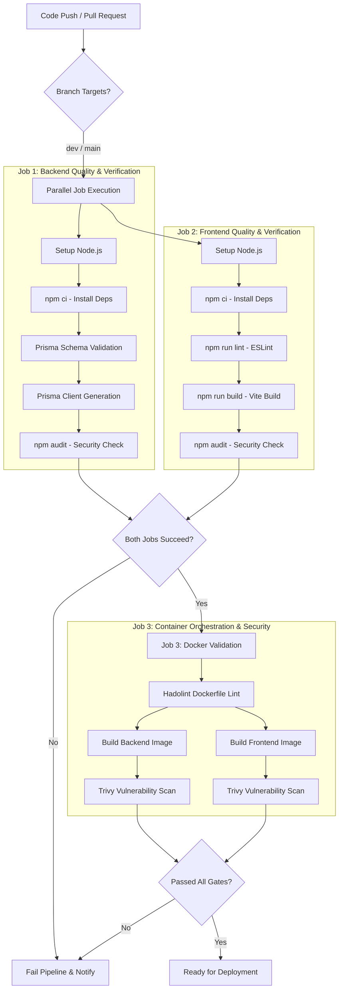

# DevOps & CI/CD Strategy
## Task Management System (INTE 21323)

This document defines the DevOps architecture, Git branching workflow, Docker container validation policies, environment variable configurations, and deployment checklists for the Task Management System (TMS).

---

## 1. CI/CD Workflow Architecture

The automated Continuous Integration (CI) and Continuous Deployment (CD) pipeline is configured using **GitHub Actions**. It triggers automatically on code pushes and pull requests to validate stability, formatting, security, and build integrity.

### Pipeline Flow



### CI Pipeline Stage Details

| Job | Steps | Tools Used | Expected Outcome / Quality Gate |
| :--- | :--- | :--- | :--- |
| **Backend Verification** | Setup, Install Dependencies, Validate Schema, Generate Prisma Client, Security Audit | Node v20, npm, Prisma CLI, npm audit | Code must compile; Prisma schema must be valid; zero high/critical vulnerabilities. |
| **Frontend Verification** | Setup, Install Dependencies, ESLint, Client build, Security Audit | Node v20, npm, ESLint, Vite compiler | Zero linting warnings/errors; bundle builds successfully under target threshold sizes; zero dependency vulnerabilities. |
| **Docker Validation** | Hadolint syntax scan, multi-stage context compilation, image vulnerability checks | Hadolint, Docker Buildx, Trivy Scan | No shell syntax issues in Dockerfile; container finishes compilation without warnings; Trivy finds zero critical system layer CVEs. |

---

## 2. Branching Strategy & Git Workflow

To maintain code quality and ensure team collaboration does not lead to conflicts, the project enforces a **Git Flow variant** using feature branches and Pull Requests.

```
       main (Production-ready code)
        │
        ├──[Merge PR / Release]
        │
       dev (Integration & Pre-production testing branch)
      ▲   ▲
      │   └───┐
      │       │ [Pull Request / Review]
    feature/auth   feature/notifications (Short-lived topic branches)
```

### Git Branching Guidelines

1. **`main` Branch**: Production-ready code. No developer may push directly to `main`. It only accepts pull requests from `dev` when a release version is ready.
2. **`dev` Branch**: The central integration branch. All features are merged here first. It acts as the staging area before going to production.
3. **`feature/*` Branches**: Short-lived branches created for specific tasks or issues.
   - Naming convention: `feature/user-auth`, `feature/websocket-notifications`, `bugfix/token-expiration`.
   - Branch off from: `dev`
   - Merge target: `dev`

### Pull Request (PR) Lifecycle

- **Creation**: When a task is complete, developers submit a PR from `feature/*` into `dev`.
- **Review Requirement**: At least **one peer review and approval** is required before merging.
- **CI Status**: The GitHub Actions workflow *must* complete successfully (green build) before the merge button becomes active.
- **Merge Method**: Merge commits are preferred for PRs to keep clear integration histories.

### Commit Message Standards

Developers must follow the **Conventional Commits** standard to make the git log readable and allow automated changelog generation.
- Format: `<type>(<scope>): <description>`
- **Types**:
  - `feat`: A new feature (e.g., `feat(auth): add JWT storage in HttpOnly cookie`)
  - `fix`: A bug fix (e.g., `fix(websocket): reconnect when connection drops`)
  - `docs`: Documentation changes only (e.g., `docs(readme): add docker setup steps`)
  - `style`: Changes that do not affect the meaning of the code (formatting, semicolon cleanups)
  - `refactor`: A code change that neither fixes a bug nor adds a feature
  - `test`: Adding missing tests or correcting existing tests
  - `chore`: Modifying build processes, helper scripts, dependencies, or tools

---

## 3. Environment Variable Standards

Security is central to our configuration management. Under no circumstances should secrets (e.g., JWT signing keys, production database credentials) be committed to version control.

### Multi-Environment Strategy

```
┌─────────────────────────┐     ┌─────────────────────────┐     ┌─────────────────────────┐
│    Local Development    │     │         Staging         │     │       Production        │
├─────────────────────────┤     ├─────────────────────────┤     ├─────────────────────────┤
│ • File: .env            │     │ • Environment variables │     │ • Secret Manager        │
│ • Database: Docker PG   │     │ • Database: Managed DB  │     │ • Secure Cloud Env      │
│ • SSL: Disabled         │     │ • SSL: Recommended      │     │ • HTTPS / WSS: Enforced │
└─────────────────────────┘     └─────────────────────────┘     └─────────────────────────┘
```

### Environment Variable Standards Table

| Variable Name | Component | Allowed Format | Purpose | Security Rule |
| :--- | :--- | :--- | :--- | :--- |
| `NODE_ENV` | Backend / Frontend | `development`, `staging`, `production` | Dictates application run modes and verbosity of logging. | Must be set to `production` in live environments. |
| `PORT` | Backend | Numeric (e.g. `3000`) | The port the Express API listens on. | Configured based on cloud provider port allocation. |
| `DATABASE_URL` | Backend | Connection String `postgresql://...` | Prisma database connection endpoint. | Keep credentials private. Never use defaults in production. |
| `JWT_SECRET` | Backend | High-entropy string (min 32 chars) | Key used to sign JWT session tokens. | Must be rotated periodically and generated cryptographically. |
| `VITE_API_URL` | Frontend | URL with HTTP/HTTPS scheme | The base endpoint for API communication. | Must use HTTPS protocol in production. |
| `VITE_SOCKET_URL` | Frontend | URL with WS/WSS scheme | The WebSocket endpoint for real-time alerts. | Must use WSS protocol in production. |

### Secrets Protection Guidelines

- **Local Development**: Copy `.env.example` to `.env` and fill in local credentials. `.env` is included in the root `.gitignore` to prevent leaks.
- **GitHub Actions Secrets**: Production secrets and cloud keys must be saved as Repository Secrets in GitHub (`JWT_SECRET_PROD`, `DB_URL_PROD`) and injected into the pipeline at runtime.

---

## 4. Docker Validation Process

Validation of the Docker images ensures containerized builds behave consistently across developer environments, staging pipelines, and final production targets.

### 1. Local Image Validation
Before pushing code, developers should run:
```bash
# Clean previous caches and build containers
docker-compose build --no-cache

# Run container cluster locally to verify integration
docker-compose up
```
Ensure that the containers bootstrap and map ports (`5173`, `3000`, and `5432`) without exiting.

### 2. Multi-Stage Production Builds (Proposed Optimization)
For deployment, the application should transition from the dev Dockerfiles to optimized multi-stage builds. This minimizes the attack surface area and dramatically reduces container size by leaving dev dependencies outside the final runner.

**Optimized Backend Dockerfile Pattern (`backend/Dockerfile.prod`):**
```dockerfile
# Stage 1: Build & Generate Prisma
FROM node:20-alpine AS builder
WORKDIR /app
COPY package*.json ./
RUN npm ci
COPY . .
RUN npx prisma generate
RUN npm prune --production

# Stage 2: Runtime Environment
FROM node:20-alpine AS runner
WORKDIR /app
ENV NODE_ENV=production
COPY --from=builder /app/package*.json ./
COPY --from=builder /app/node_modules ./node_modules
COPY --from=builder /app/src ./src
COPY --from=builder /app/prisma ./prisma
EXPOSE 3000
CMD ["npm", "run", "start"]
```

**Optimized Frontend Dockerfile Pattern (`frontend/Dockerfile.prod`):**
```dockerfile
# Stage 1: Compile Vite Assets
FROM node:20-alpine AS builder
WORKDIR /app
COPY package*.json ./
RUN npm ci
COPY . .
RUN npm run build

# Stage 2: Serve via Nginx
FROM nginx:1.25-alpine AS runner
COPY --from=builder /app/dist /usr/share/nginx/html
# Custom Nginx configuration supporting SPA routing and HTTPS redirections
COPY nginx.conf /etc/nginx/conf.d/default.conf
EXPOSE 80
CMD ["nginx", "-g", "daemon off;"]
```

### 3. Container Health Checks
To allow orchestrators (like Docker Compose, AWS ECS, or Kubernetes) to automatically monitor container health and manage restarts:

- **Backend Health Check**:
  Add a health check to `docker-compose.yml` or within the orchestrator targeting a `/api/health` HTTP endpoint:
  ```yaml
  healthcheck:
    test: ["CMD", "wget", "--no-verbose", "--tries=1", "--spider", "http://localhost:3000/api/health"]
    interval: 30s
    timeout: 10s
    retries: 3
    start_period: 10s
  ```

---

## 5. Deployment Checklist

To guarantee successful deployments in staging and production, the deployment engineer must complete these operations:

- [ ] **Infrastructure & SSL validation**:
  - [ ] Enforce HTTPS (TLS v1.2 or v1.3).
  - [ ] Configure WSS secure WebSockets.
  - [ ] Configure DNS records and bind SSL certificates.
- [ ] **Database Pre-Deployment**:
  - [ ] Verify production database connection string (`DATABASE_URL`).
  - [ ] Perform a dry-run migration to check for data-destructive changes.
  - [ ] Run Prisma migration deployment: `npx prisma migrate deploy`.
- [ ] **Network & Access Configurations**:
  - [ ] Set up CORS origin allowed values on backend (restrict to production frontend URL).
  - [ ] Ensure database port (`5432`) is not accessible from the public internet. Only backend API server subnets should communicate with the PostgreSQL instance.
- [ ] **Container Startup Checks**:
  - [ ] Confirm environment variables (`NODE_ENV=production`) are injected.
  - [ ] Verify standard log outputs to track boot errors.

---

## 6. Release Readiness Checklist

This checklist must be fully verified and checked off prior to marking any release tag as **Production Ready**.

- [ ] **Functional Stability**: All core functional requirements (User Authentication, Task CRUD, WebSocket alerts) verified.
- [ ] **Build Validation**: The GitHub Actions integration pipeline is fully green for the target commit.
- [ ] **Security Compliance**:
  - [ ] Trivy vulnerability scan reports zero `CRITICAL` or `HIGH` vulnerabilities in both containers.
  - [ ] `npm audit` reports zero high-priority alerts in dependencies.
  - [ ] OWASP Top 10 guidelines followed (Inputs sanitized, JWT HTTP-only storage verified, helmet integration enabled).
- [ ] **Monitoring & Reliability**:
  - [ ] Error logging middleware is operational on the backend.
  - [ ] Reconnection strategies for WebSockets verified under network degradation.
- [ ] **Rollback Strategy**:
  - [ ] In the event of a critical failure during rollout, verify the mechanism to redeploy the previous stable Docker image tag instantly.
  - [ ] Database backup snapshot created before the deployment.

---

## 7. Branch Protection Rules (GitHub Repository Settings)

To guarantee that no code is merged into protected branches (`main` and `dev`) without meeting our rigorous quality gates, administrators must configure the following branch protection rules in the GitHub repository settings.

### 7.1 main Branch Protection Rules
* **Path**: Settings -> Branches -> Add branch protection rule
* **Branch name pattern**: `main`
* **Protection Configurations**:
  * **Require a pull request before merging**: Enforce all code changes to pass through a Pull Request. Direct pushes to `main` are blocked.
    * **Require approvals**: Enabled, with a minimum of **1 approval** required (recommending peer reviews).
    * **Dismiss stale pull request approvals when new commits are pushed**: Enabled, to force re-review if the code changes.
  * **Require status checks to pass before merging**: Blocks merging until the CI pipeline runs successfully.
    * **Require branches to be up to date before merging**: Enabled, to ensure the feature branch contains all changes from `main`.
    * **Status Checks Required**:
      * `Backend Checks (Node.js & Prisma)` (validates Express, Prisma and ESLint compiling)
      * `Frontend Checks (React & Vite)` (validates React production build and ESLint)
      * `Docker Compose Validation` (validates Docker Compose YAML structure)
  * **Require conversation resolution before merging**: Enabled, ensuring all code comments/reviews are marked as resolved.
  * **Restrict who can push to matching branches**: Only allowed for automated releases or administrators.

### 7.2 dev Branch Protection Rules
* **Branch name pattern**: `dev`
* **Protection Configurations**:
  * **Require a pull request before merging** (Require approvals: **1 approval**).
  * **Require status checks to pass before merging** (Status Checks Required: same list as above).
  * **Block force pushes** (Enforced on both branches).
